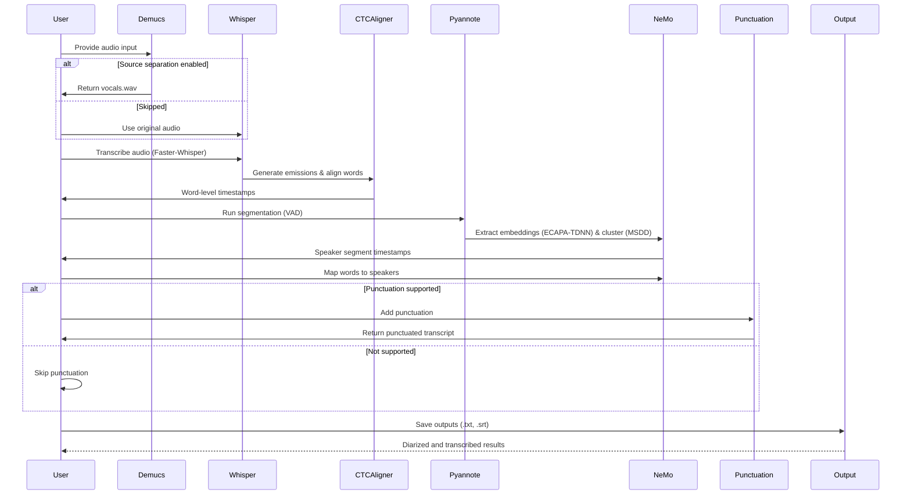
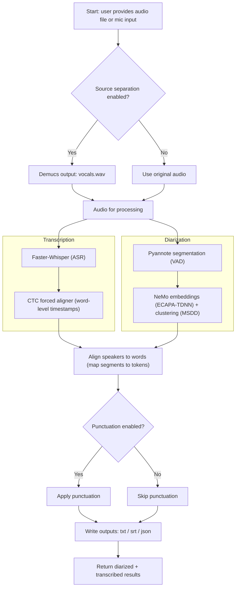

# MIE_Diarization
This is a Diarization and summarization project, which uses the Pyannote segmentation model along with NeMo diarization components (embeddings and clustering), and Faster-Whisper for transcription. For summarization I've used Ozwell Ai which is an AI agent for the MIE.

This project is my summer internship work, which I've worked on alone.

Below are some shorts/videos about the project and my research:
## 🎬 Project Shorts

| 🎥 Topic                                                  | 🔗 Watch                                                                 |
|-----------------------------------------------------------|--------------------------------------------------------------------------|
| 📊 **Full Project Overview**                              | [Watch on YouTube](https://youtube.com/shorts/aS2HU26QRXU?si=piUQbxEMDIeN3q_) |
| 📈 **Pipeline Sequence Diagram Explained**                | [Watch on YouTube](https://www.youtube.com/shorts/YQj7j3qZjcw)           |
| ⚙️ **Hyperparameters Walkthrough**                        | [Watch on YouTube](https://youtube.com/shorts/heUgx4hOj-k?si=TEbm6r_HaTvYDcDn) |
| 🤖 **Whisper Model Comparison & Faster-Whisper Insights** | [Watch on YouTube](https://youtube.com/shorts/H21NiwoXnQg?si=Sqt_Jc2ZTt-Qgu5x) |


Below is the description for running the diarization pipeline. This work couldn't have been possible without the project of diarization from https://github.com/MahmoudAshraf97/whisper-diarization

<h1 align="center">Speaker Diarization Using OpenAI Whisper</h1>

<p align="center">
  <a href="https://github.com/MahmoudAshraf97/whisper-diarization/actions/workflows/test_run.yml">
    
  </a>
  <a href="https://github.com/MahmoudAshraf97/whisper-diarization/stargazers">
    
  </a>
  <a href="https://github.com/MahmoudAshraf97/whisper-diarization/issues">
        
  </a>
  <a href="https://github.com/MahmoudAshraf97/whisper-diarization/blob/master/LICENSE">
        
  </a>
  <a href="https://twitter.com/intent/tweet?text=&url=https%3A%2F%2Fgithub.com%2FMahmoudAshraf97%2Fwhisper-diarization">
  
  </a> 
  </a>
  <a href="https://colab.research.google.com/github/MahmoudAshraf97/whisper-diarization/blob/main/Whisper_Transcription_%2B_NeMo_Diarization.ipynb">
  
  </a>
 
</p>


# 
Speaker Diarization pipeline based on OpenAI Whisper

 **Please, star the project on github (see top-right corner) if you appreciate my contribution to the community!**

## What is it
This repository combines Faster-Whisper ASR capabilities with Pyannote's segmentation model for Voice Activity Detection (VAD) and initial segmentation, and NeMo components including ECAPA-TDNN and MSDD for speaker embeddings and clustering to identify the speaker for each sentence in the transcription generated by Faster-Whisper. First, the vocals are extracted from the audio to increase the speaker embedding accuracy, then the transcription is generated using Faster-Whisper, then the timestamps are corrected and aligned using `ctc-forced-aligner` to help minimize diarization error due to time shift. The audio is then passed into Pyannote's segmentation model for VAD and segmentation to exclude silences, NeMo's ECAPA-TDNN and MSDD components are then used to extract speaker embeddings and cluster speakers to identify the speaker for each segment, the result is then associated with the timestamps generated by `ctc-forced-aligner` to detect the speaker for each word based on timestamps and then realigned using punctuation models to compensate for minor time shifts.


Whisper and NeMo parameters are coded into diarize.py and helpers.py, I will add the CLI arguments to change them later
## Installation
Python >= `3.10` is needed, `3.9` will work but you'll need to manually install the requirements one by one.

`FFMPEG` and `Cython` are needed as prerequisites to install the requirements
```
pip install cython
```
or
```
sudo apt update && sudo apt install cython3
```
```
# on Ubuntu or Debian
sudo apt update && sudo apt install ffmpeg

# on Arch Linux
sudo pacman -S ffmpeg

# on MacOS using Homebrew (https://brew.sh/)
brew install ffmpeg

# on Windows using Chocolatey (https://chocolatey.org/)
choco install ffmpeg

# on Windows using Scoop (https://scoop.sh/)
scoop install ffmpeg

# on Windows using WinGet (https://github.com/microsoft/winget-cli)
winget install ffmpeg
```
```
pip install -c constraints.txt -r requirements.txt
```
## Usage 

```
python diarize.py -a AUDIO_FILE_NAME
```

If your system has enough VRAM (>=10GB), you can use `diarize_parallel.py` instead, the difference is that it runs NeMo in parallel with Whisper, this can be beneficial in some cases and the result is the same since the two models are nondependent on each other. This is still experimental, so expect errors and sharp edges. Your feedback is welcome.

## Command Line Options

- `-a AUDIO_FILE_NAME`: The name of the audio file to be processed
- `--no-stem`: Disables source separation
- `--whisper-model`: The model to be used for ASR, default is `medium.en`
- `--suppress_numerals`: Transcribes numbers in their pronounced letters instead of digits, improves alignment accuracy
- `--device`: Choose which device to use, defaults to "cuda" if available
- `--language`: Manually select language, useful if language detection failed
- `--batch-size`: Batch size for batched inference, reduce if you run out of memory, set to 0 for non-batched inference

## Known Limitations
- Overlapping speakers are yet to be addressed, a possible approach would be to separate the audio file and isolate only one speaker, then feed it into the pipeline but this will need much more computation
- There might be some errors, please raise an issue if you encounter any.

## Future Improvements
- Implement a maximum length per sentence for SRT

## Acknowledgements
Special Thanks for [@adamjonas](https://github.com/adamjonas) for supporting this project
This work is based on [OpenAI's Whisper](https://github.com/openai/whisper) , [Faster Whisper](https://github.com/guillaumekln/faster-whisper) , [Nvidia NeMo](https://github.com/NVIDIA/NeMo) , [Facebook's Demucs](https://github.com/facebookresearch/demucs), and [Pyannote](https://github.com/pyannote/pyannote-audio) for segmentation.

## Citation
If you use this in your research, please cite the project:

```bibtex
@unpublished{hassouna2024whisperdiarization,
  title={Whisper Diarization: Speaker Diarization Using OpenAI Whisper},
  author={Ashraf, Mahmoud},
  year={2024}
}
```

If the following things don't work do the following:
1. Upgrade you python to 3.10+ version.

If you're still getting the error of the ctc-forced-aligner. Try installing ctc forced aligner from the https://github.com/ayushdh96/MIE_Diarization/tree/main/ctc-forced-aligner into a venv or your machine if you've the root access and are not managing different envs. The try running the command
```
pip install -c constraints.txt -r requirements.txt
```
and then run the file as stated above

This is how the flow is:
## 🔄 Diarization + Transcription Pipeline (Sequence Diagram)



---

## 🔄 Diarization + Transcription Pipeline (Flow Diagram)


